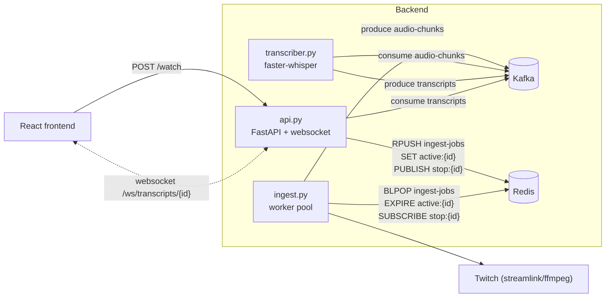

# twitch-transcript

Live speech-to-text pipeline for a Twitch stream (streamlink -> ffmpeg -> Kafka
-> faster-whisper -> Kafka -> websocket API -> React frontend). See
`DESIGN.md` for architecture details and rationale.

## Layout

```
backend/    Kafka + ingest + transcriber + api services (Docker Compose)
frontend/   React (Vite) app that displays live subtitles
```

## Architecture



## Backend

### Requirements

- Docker Desktop (or Docker Engine + Compose plugin)

### Configuration

`CHUNK_SECONDS` (audio chunk length in seconds) is set in
`backend/docker-compose.yml` and must match on both `ingest` and
`transcriber`. There's no `STREAMER_ID` to configure — `ingest` runs as a
generic worker pool and is told which streamer to handle at runtime via the
frontend's **Watch** button (`POST /watch`), not an env var.

### Python environment

From `backend/`:

```
python -m venv venv
venv\Scripts\pip install confluent-kafka streamlink faster-whisper fastapi "uvicorn[standard]" redis pydantic
```

(`venv/Scripts/...` on Windows; `venv/bin/...` on macOS/Linux.)

### Start

From `backend/`:

```
docker compose up --build
```

`--build` is only needed after changing `ingest.py`, `transcriber.py`,
`api.py`, or a `Dockerfile.*`. On later runs without code changes,
`docker compose up` alone is enough.

Runs in the foreground; `Ctrl+C` stops it. To run in the background instead:

```
docker compose up --build -d
```

### View logs

If running in the foreground, logs from all 4 services (`kafka`, `ingest`,
`transcriber`, `api`) print directly to the terminal.

If running detached (`-d`), or to view logs later:

```
docker compose logs -f
```

Transcribed text is printed by the `transcriber` service. To follow just that:

```
docker compose logs -f transcriber
```

Other services: `docker compose logs -f ingest` / `docker compose logs -f api`
/ `docker compose logs -f kafka`.

### Stop

Pause (keeps containers, resume instantly with `docker compose start`):

```
docker compose stop
```

Full teardown (removes containers; images stay cached, so the next
`docker compose up` doesn't need to rebuild unless code changed):

```
docker compose down
```

## Frontend

### Requirements

- Node.js + npm

### Start

From `frontend/`:

```
npm install
npm run dev
```

Opens on `http://localhost:5173` by default. Requires the backend `api`
service to be reachable at `ws://localhost:8000` (i.e. the backend stack
already running via `docker compose up`).

In the page, type the `STREAMER_ID` configured on the `ingest` service (e.g.
`dead_oryx`) and click **Watch** to open the websocket and start receiving
live transcript lines.

Stop the dev server with `Ctrl+C`.
