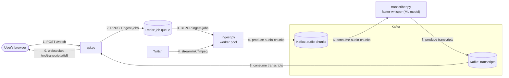

# twitch-transcription

Live speech-to-text pipeline for a Twitch stream (streamlink -> ffmpeg -> Kafka
-> faster-whisper -> Kafka -> websocket API -> React frontend). See
`DESIGN.md` for architecture details and rationale.

## Layout

```
backend/    Kafka + ingest + transcriber + api services
frontend/   React (Vite) app that displays live subtitles
```

## Architecture



## Run it

Runs Kafka, Redis, `ingest`, `transcriber`, `api`, and the frontend dev
server together — as a local Kubernetes (k3d) cluster, plus autoscaling
(KEDA) and monitoring (Prometheus/Grafana). Manifests live in `k8s/`.

### Requirements

- Docker Desktop (or Docker Engine)
- [k3d](https://k3d.io/) — lightweight local Kubernetes via Docker
- `kubectl`
- [Helm](https://helm.sh/) — installs KEDA and the monitoring stack
- Node.js — for `scripts/*.mjs` below and the frontend dev server

```
node scripts/start-k8s.mjs                 # full sequence, waits for Ctrl+C
node scripts/start-k8s.mjs --skip-build     # reuse existing images (no code changes)
node scripts/start-k8s.mjs --skip-frontend  # don't start the frontend dev server
node scripts/start-k8s.mjs --watch          # tail pod status instead of starting the frontend
```

Creates/resumes the cluster, builds and imports images, installs KEDA,
applies `k8s/`, installs Prometheus/Grafana, starts the frontend dev server,
then waits for `Ctrl+C` — which stops the frontend and pauses the cluster
(`k3d cluster stop`, state kept for an instant resume next run).

Full teardown (deletes the cluster entirely — next `start-k8s.mjs` run starts
from scratch, reinstalling KEDA/monitoring too):

```
node scripts/delete-k8s.mjs
```

Once it's up, open `http://localhost:5173`, type the `STREAMER_ID`
configured on the `ingest` service (e.g. `dead_oryx`), and click **Watch**
to open the websocket and start receiving live transcript lines.

### Monitoring

Prometheus + Grafana (`kube-prometheus-stack`, config in
`k8s/monitoring/values.yaml`). `transcriber` exposes app metrics
(`transcriber_chunks_processed_total`, `transcriber_inference_seconds`) via a
`PodMonitor` (`k8s/monitoring/podmonitors/`) — everything else is generic
cluster CPU/mem from the chart's defaults.

```
kubectl port-forward -n monitoring svc/monitoring-grafana 3000:80
```

Open `http://localhost:3000` (login: `admin` / `admin`).

Need a faster way to debug the program itself, without the KEDA/monitoring
overhead? See [`docs/docker-compose.md`](docs/docker-compose.md) — plain
Docker Compose, no cluster involved, at the cost of no autoscaling and no
monitoring.

## Backend development

### Configuration

`CHUNK_SECONDS` (audio chunk length in seconds) is set separately on both
`k8s/06-keda-ingest.yaml` (`ingest`) and `k8s/04-transcriber.yaml`
(`transcriber`), and the two must match. There's no `STREAMER_ID` to
configure — `ingest` runs as a generic worker pool and is told which
streamer to handle at runtime via the frontend's **Watch** button
(`POST /watch`), not an env var.

### Python environment

For local IDE support (linting, autocomplete) when editing the backend
scripts directly. From `backend/`:

```
python -m venv venv
venv\Scripts\pip install confluent-kafka streamlink faster-whisper fastapi "uvicorn[standard]" redis pydantic
```

(`venv/Scripts/...` on Windows; `venv/bin/...` on macOS/Linux.)
